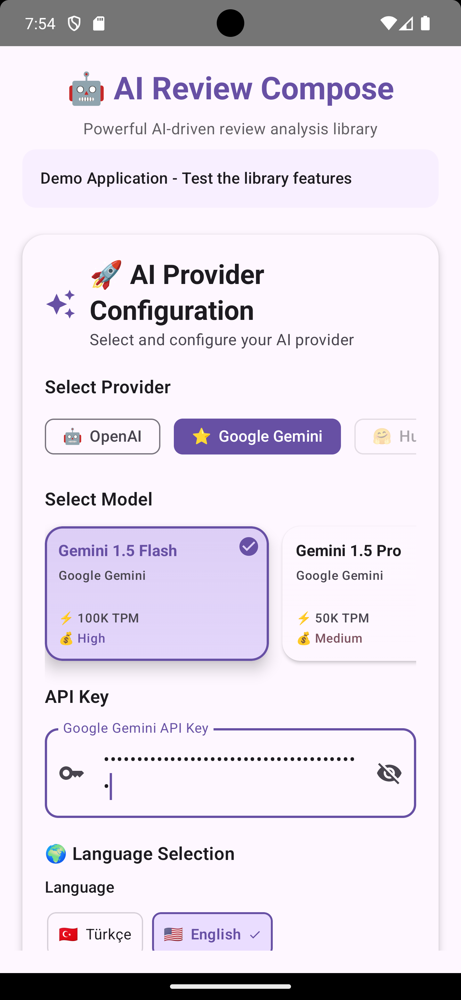
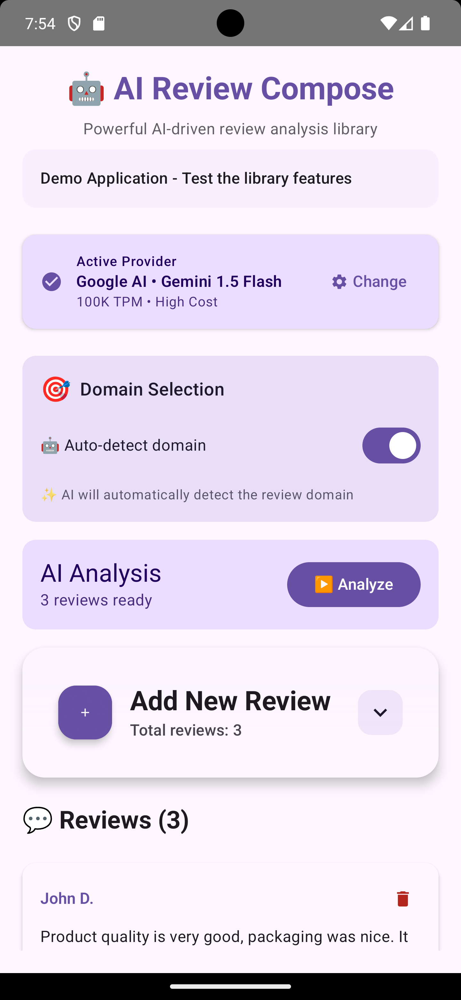
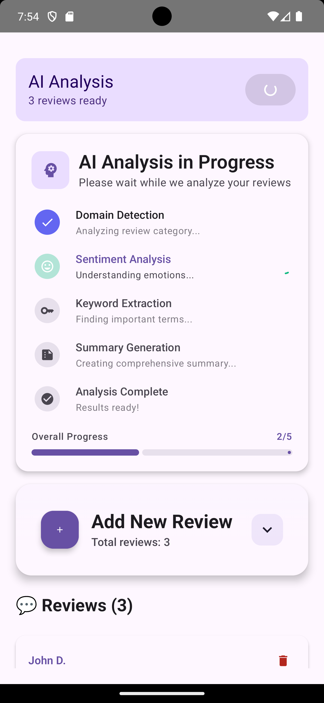
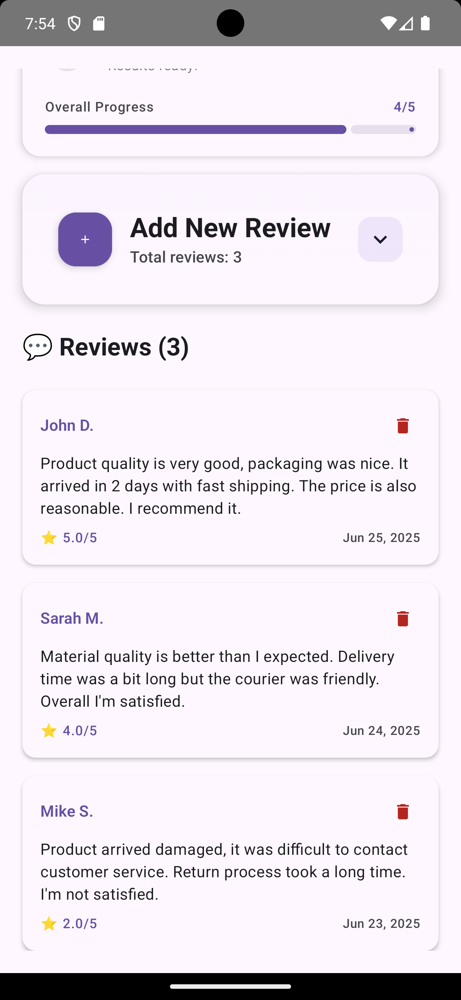
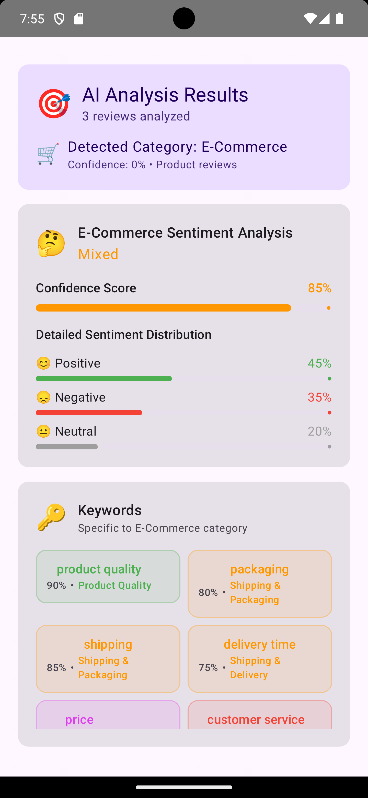
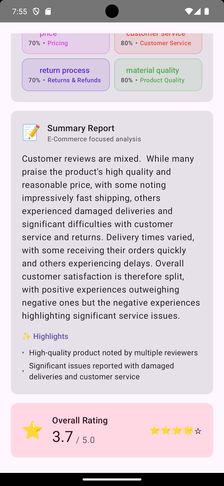

# AI Review Compose 🤖📱

[](https://jitpack.io/#ilkeryildirim/compose-ai-review)
[](https://opensource.org/licenses/MIT)
[](https://developer.android.com)
[](https://developer.android.com/jetpack/compose)
[](https://android-arsenal.com/api?level=21)

A powerful Android library for AI-powered review analysis using **OpenAI** and **Google Gemini** providers. Built with **Jetpack Compose** and **Kotlin**, this library provides comprehensive sentiment analysis, keyword extraction, and intelligent summaries for user reviews.

## ✨ Features

- 🧠 **Multiple AI Providers**: Support for OpenAI (GPT-3.5, GPT-4, GPT-4o) and Google Gemini
- 📊 **Comprehensive Analysis**: Sentiment analysis, keyword extraction, and intelligent summaries
- 🌍 **Multi-language Support**: Multi-language support
- 🎨 **Jetpack Compose UI**: Modern, beautiful UI components
- 🔄 **Provider Switching**: Dynamic switching between AI providers
- 🏗️ **Domain-specific Insights**: Customizable domain analysis (e-commerce, hospitality, etc.)
- 📱 **Easy Integration**: Simple API with dependency injection support
- 🚀 **Production Ready**: Built with SOLID principles and clean architecture

## 📸 Screenshots

<div align="center">

| Setup & Configuration | Provider Selection | Analysis Started |
|:---:|:---:|:---:|
|  |  |  |
| API Key Setup | Provider Selection | Analysis in Progress |

| Analysis Screen (Ready) | Reviews & Results | AI Response |
|:---:|:---:|:---:|
|  |  |  |
| Analysis Ready | Keywords & Sentiment | Complete AI Analysis |

</div>

*Screenshots showing the complete workflow: API key setup, provider selection, analysis in progress, analysis ready state, keyword & sentiment results, and final AI-generated insights.*

### 🎬 Live Demo
To see the library in action, clone the repository and run the sample app:

```bash
git clone https://github.com/ilkeryildirim/compose-ai-review.git
cd compose-ai-review
# Open in Android Studio and run the app module
```

## 🚀 Quick Start

### Step 1: Add JitPack Repository

Add JitPack repository to your `settings.gradle.kts`:

```kotlin
dependencyResolutionManagement {
    repositories {
        google()
        mavenCentral()
        maven { url = uri("https://jitpack.io") }
    }
}
```

### Step 2: Add Dependencies

Add the dependency to your `build.gradle.kts` (Module: app):

```kotlin
dependencies {
    // AI Review Compose Library
    implementation 'com.github.ilkeryildirim:compose-ai-review:v1.0.3'
    
    // Required dependencies (if not already added)
    implementation 'com.google.dagger:hilt-android:2.48'
    kapt 'com.google.dagger:hilt-compiler:2.48'
    implementation 'androidx.hilt:hilt-navigation-compose:1.1.0'
}
```

### Step 3: Enable Hilt

Add Hilt plugin to your app-level `build.gradle.kts`:

```kotlin
plugins {
    id 'dagger.hilt.android.plugin'
    id 'kotlin-kapt'
}
```

### Alternative: Clone Complete Project

To explore the full implementation and run the sample app:

```bash
git clone https://github.com/ilkeryildirim/compose-ai-review.git
cd compose-ai-review
```

Open the project in Android Studio and run the `app` module to see the library in action with a complete demo.

## 📖 Usage

### 1. Setup Hilt in Your Application

```kotlin
@HiltAndroidApp
class MyApplication : Application()
```

### 2. Initialize the Library

```kotlin
@AndroidEntryPoint
class MainActivity : ComponentActivity() {

    @Inject
    lateinit var aiReviewCompose: AIReviewCompose

    override fun onCreate(savedInstanceState: Bundle?) {
        super.onCreate(savedInstanceState)

        // Initialize with OpenAI
        lifecycleScope.launch {
            aiReviewCompose.initialize(
                providerType = AIProviderType.OPENAI,
                apiKey = "your-openai-api-key",
                model = AIModel.GPT_4O_MINI,
                language = "en"
            )
        }
    }
}
```

### 3. Analyze Reviews

```kotlin
// Create sample reviews
val reviews = listOf(
    Review(
        id = "1",
        content = "Great product! Fast delivery and excellent quality.",
        rating = 5
    ),
    Review(
        id = "2", 
        content = "Poor customer service, very disappointed.",
        rating = 2
    )
)

// Analyze reviews
lifecycleScope.launch {
    try {
        val analyzer = aiReviewCompose.getAnalyzer()
        val analysis = analyzer.analyzeReviews(reviews)

        // Use the results
        println("Overall sentiment: ${analysis.overallSentiment}")
        println("Key insights: ${analysis.insights}")
        analysis.keywords.forEach { keyword ->
            println("Keyword: ${keyword.word} (${keyword.frequency})")
        }
    } catch (e: Exception) {
        println("Analysis failed: ${e.message}")
    }
}
```

### 4. Switch Between Providers

```kotlin
// Switch to Google Gemini
lifecycleScope.launch {
    aiReviewCompose.switchProvider(
        providerType = AIProviderType.GOOGLE,
        apiKey = "your-gemini-api-key",
        model = AIModel.GEMINI_1_5_FLASH
    )
}
```

## 🔧 Advanced Configuration

### Custom Domain Insights

```kotlin
class CustomInsightProvider : DomainInsightProvider {
    override suspend fun getDomainInsights(
        domain: ReviewDomain,
        language: String
    ): String {
        return when (domain) {
            ReviewDomain.ECOMMERCE -> "Focus on delivery, product quality, and customer service"
            ReviewDomain.RESTAURANT -> "Analyze food quality, service speed, and ambiance"
            else -> "General business insights"
        }
    }
}

// Use custom provider
aiReviewCompose.initialize(
    providerType = AIProviderType.OPENAI,
    apiKey = "your-api-key",
    customInsightProvider = CustomInsightProvider()
)
```

### Available Models

**OpenAI Models:**

- `AIModel.GPT_3_5_TURBO`
- `AIModel.GPT_4`
- `AIModel.GPT_4O`
- `AIModel.GPT_4O_MINI`

**Google Gemini Models:**

- `AIModel.GEMINI_1_5_PRO`
- `AIModel.GEMINI_1_5_FLASH`

## 🏗️ Architecture

The library follows clean architecture principles:

```
ai-review-compose/
├── core/                 # Core business logic
│   ├── analyzers/       # Analysis implementations
│   ├── providers/       # AI provider abstractions
│   └── prompts/         # Prompt management
├── data/                # Data models
├── domain/              # Use cases
├── di/                  # Dependency injection
└── providers/           # Provider implementations
    ├── openai/          # OpenAI implementation
    └── gemini/          # Google Gemini implementation
```

## 🔑 API Keys Setup

### OpenAI API Key

1. Visit [OpenAI Platform](https://platform.openai.com/)
2. Create an account and navigate to API Keys
3. Generate a new API key

### Google Gemini API Key

1. Visit [Google AI Studio](https://makersuite.google.com/app/apikey)
2. Create a new API key
3. Enable the Gemini API

⚠️ **Security Note**: Never hardcode API keys in your source code. Use BuildConfig, environment variables, or secure storage.

## 📋 Requirements

- **Android API Level**: 21+
- **Kotlin**: 1.9.0+
- **Compose**: 1.5.4+
- **Java**: 11+

## 🤝 Contributing

Contributions are welcome! Please feel free to submit a Pull Request.

1. Fork the project
2. Create your feature branch (`git checkout -b feature/AmazingFeature`)
3. Commit your changes (`git commit -m 'Add some AmazingFeature'`)
4. Push to the branch (`git push origin feature/AmazingFeature`)
5. Open a Pull Request

## 📄 License

This project is licensed under the MIT License - see the [LICENSE](LICENSE) file for details.

## 🙏 Acknowledgments

- [OpenAI](https://openai.com/) for providing powerful language models
- [Google](https://ai.google.dev/) for Gemini AI capabilities
- [Jetpack Compose](https://developer.android.com/jetpack/compose) for modern UI toolkit
- [Hilt](https://dagger.dev/hilt/) for dependency injection

## 📞 Support

If you have any questions or need help, please:

1. Check the [Issues](https://github.com/ilkeryildirim/compose-ai-review/issues) page
2. Create a new issue if your problem isn't already reported
3. Star ⭐ the repository if you find it useful
4. Contact: ilkeryildirimdev@gmail.com

### 📈 JitPack Status

Check the build status on [JitPack](https://jitpack.io/#ilkeryildirim/compose-ai-review) to ensure the latest version is available.

---

**Made with ❤️ by [Ilker Yildirim](https://github.com/ilkeryildirim)** 
